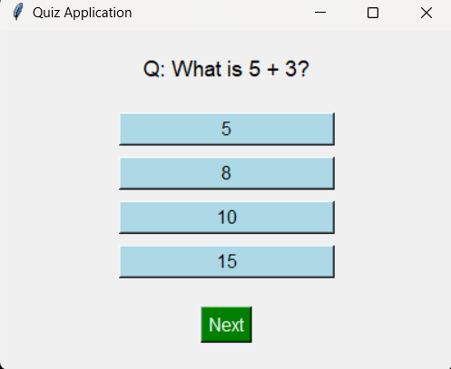

# Quiz Game

## **Description**
A fun and interactive quiz game where players answer multiple-choice questions. The game keeps track of the user's score and provides immediate feedback on each answer.

---

## **Features**
- Randomized questions for a unique experience each time.
- Immediate feedback on whether your answer is correct or incorrect.
- Displays the final score at the end of the game.

---

## **Requirements**
- Python 3.x
- No additional libraries are required.

---

## **How to Run**
1. Save the code as `quiz_game.py`.
2. Run the script using the following command:
   ```bash
   python quiz_game.py
   ```

## Screenshot


   
## How to Use
- The game displays questions and answer choices (A/B/C/D).
- Type the letter corresponding to your answer.
- View your final score after completing the quiz.
